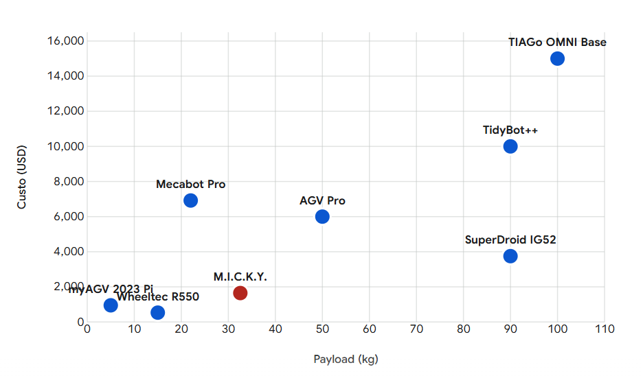

# Comparative Analysis

## Introduction

The development of low-cost and accessible robotic platforms remains a critical challenge for teams entering competitive and research-oriented environments such as RoboCup@Industrial, particularly in regions with limited funding such as Latin America. High costs associated with commercial mobile bases often create a significant barrier to entry, restricting participation and slowing down innovation.

In this context, we present the M.I.C.K.Y. mobile base, an omnidirectional robotic platform specifically designed to reduce this barrier by prioritizing cost-efficiency without compromising mechanical capability. The platform adopts a modular architecture based on industrial 40x40 mm aluminum profiles and a Mecanum wheel drive system, enabling holonomic motion and supporting substantial payloads.

Rather than relying on expensive proprietary solutions, M.I.C.K.Y. is built using Commercial Off-The-Shelf (COTS) components and a simplified mechanical design. This approach allows the platform to achieve a high payload-to-cost ratio while remaining accessible, maintainable, and adaptable to different use cases.

The system is designed to support mobile manipulation, autonomous navigation, and general-purpose robotics research, while allowing straightforward integration of sensors, actuators, and additional subsystems. Its modularity ensures that the platform can evolve according to the needs of each team.

This work also presents a comparative analysis between M.I.C.K.Y. and other omnidirectional mobile bases, emphasizing its efficiency in terms of cost versus payload. The results highlight its position as a competitive and accessible alternative for teams seeking high mechanical performance under budget constraints.

Ultimately, the goal of this project is to democratize access to mobile robotics by providing a scalable, reproducible, and economically viable platform for new teams and researchers.

---

## 1. Technical Characterization of the M.I.C.K.Y. Base

The M.I.C.K.Y. base utilizes a structure made of industrial 40x40 mm aluminum profiles and a Mecanum wheel-based drive system. Although the hardware includes 6 motors, the software and kinematic configuration uses 4 active motors for locomotion.

- **Total Cost (BOM):** ~$1647.12 USD
- **Operational Payload:** 32.55 kg
- **Actuators (Active):** 4x NEMA 23 stepper motors with 30 kgf·cm torque each
- **Wheels:** Mecanum MEC-100 set (100 mm diameter). Nominal capacity of 15 kg per wheel
- **Structure:** Modular chassis using 40x40 mm aluminum profiles (Slot 8)

### 1.1 Torque and Dynamic Force Calculations

The performance of the base under load is determined by the effective torque at the shafts and the wheel radius:

- **Total Gross Torque ($T_{total}$):**

    **$T_{total}$ = 4 × 30 kgf·cm = 120 kgf·cm ≈ 11.77 Nm**

- **Total Tangential Force ($F_t$):** For wheels with radius $r = 5 cm$:

    **$F_t$ = 120 kgf·cm / 5 cm = 24 kgf**

With a traction force of 24 kgf for a payload of 32.55 kg (plus a base mass of ~25 kg), the platform operates with a **Traction-to-Total Weight Ratio of ~0.41**, ensuring stability during lateral strafing maneuvers without step loss under moderate accelerations.

---

## 2. Comparative Table: Omnidirectional Bases

Below is a compilation of technical data for the requested platforms, including low-cost models and industrial reference systems.

| Model (Label) | Payload (kg) | Cost (USD) | Drive Type | Efficiency ($/kg) |
|--------------|-------------|------------|------------|------------------|
| M.I.C.K.Y. | 32.55 | $1647.12 | Mecanum (4-wheel drive) | $50.60 |
| Wheeltec R550 | 15.00 | $532 | Mecanum (4-wheel drive) | $35.46 |
| myAGV 2023 Pi | 5.00 | $949 | Mecanum (planetary) | $189.80 |
| Mecabot Pro | 22.00 | $6,918 | Mecanum (with suspension) | $314.45 |
| SuperDroid IG52 | 90.00 | $3,750 | Mecanum (chain-driven) | $41.66 |
| AGV Pro | 50.00 | ~$6,000* | Mecanum/Omni | $120.00 |
| TIAGo OMNI Base | 100.00 | ~$15,000* | Mecanum (industrial) | $150.00 |
| TidyBot++ | 90.00 | ~$10,000* | Powered casters | $111.11 |

---

## 3. Cost vs. Payload Analysis

The scatter plot (represented by the axes below) allows identification of design efficiency. Platforms located in the lower-right quadrant represent the highest payload delivery per dollar invested.

### 3.1 M.I.C.K.Y. Positioning Discussion

The analysis reveals that M.I.C.K.Y. occupies an **Efficiency Anomaly** niche.

- **M.I.C.K.Y. vs. myAGV 2023 Pi:**  
While the cost is higher (~$1647 vs $949), M.I.C.K.Y. delivers **6.5× more payload** (32.55 kg vs 5 kg).  
This highlights a significantly better cost-to-performance ratio in practical applications.

- **M.I.C.K.Y. vs. Mecabot Pro:**  
Mecabot Pro costs over four times more, yet its payload is **32% lower (22 kg)**.  
M.I.C.K.Y. demonstrates that higher mechanical traction capacity can be achieved using industrial COTS components at a fraction of the cost.

### 3.2 The Industrial Challenge: TIAGo OMNI Base and SuperDroid

These platforms represent the upper limits of payload capacity.

- **TIAGo OMNI Base:**  
It is a benchmark in service robotics design. With 207 mm wheels and industrial-grade motors, it supports a 100 kg payload.  
M.I.C.K.Y. achieves **~32% of this payload at ~11% of the cost**, making it a viable alternative for budget-constrained laboratories.

- **SuperDroid IG52:**  
Achieves payloads of 90 kg through a chain reduction system (10:15).  
While effective for heavy loads, the chain system requires lubrication and tension adjustment, whereas M.I.C.K.Y.’s direct coupling reduces mechanical maintenance.

---

## 4. Materials and Maintainability Analysis

- **Chassis (40x40 mm Aluminum vs. 3 mm Plate):**  
The use of 40x40 mm profiles in M.I.C.K.Y. provides a significantly higher section moment of inertia compared to the 3 mm plates of the Wheeltec R550 or the ABS chassis of the myAGV.  
This enables the platform to support a 32.55 kg payload statically without long-term deformation.

- **Modularity:**  
The use of T-slot nuts within the profile rails allows repositioning of sensors such as the BNO055 and the TP-Link USB 3.0 hub to balance the center of mass as payload increases.  
Laser-cut metal bases (Mecabot/SuperDroid) lack this flexibility without structural modifications.